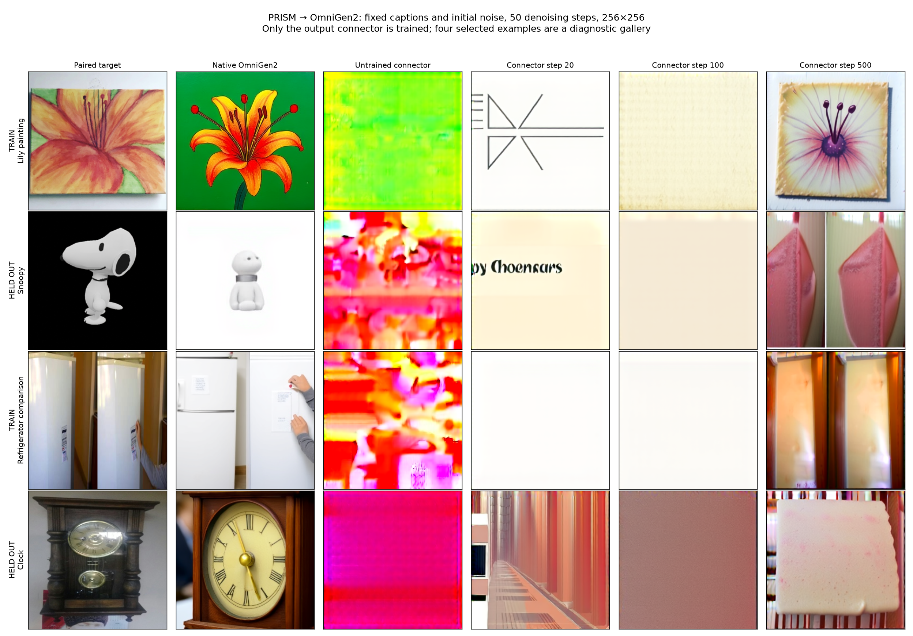
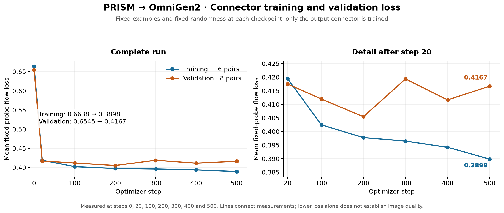
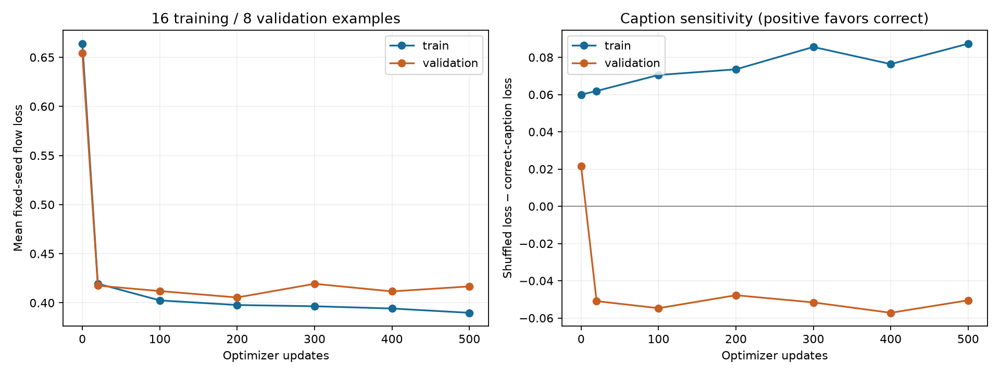
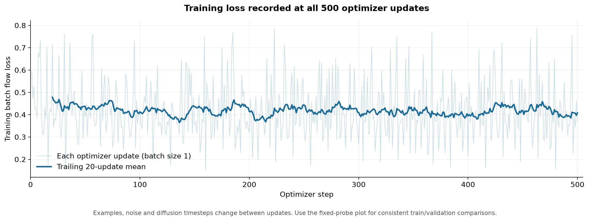
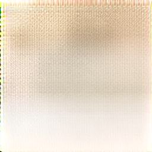

# Initial PRISM image-generation results

These are the saved results of the 2026-09-21 Aurora experiments. **The connector
learned some training-image content, but the sampled validation prompts failed.**
The artifacts remain unqualified diagnostics. No new training or inference was
run to create this committed evidence bundle.

The model uses the trained PRISM Qwen3-8B parent, a trainable LayerNorm(4096) plus
Linear(4096, 2048) connector, and frozen OmniGen2 generation components. Only the
8,398,848 connector parameters were optimized. The parent, generator and VAE
remained frozen.

## Matched generation comparison

Each row uses the same caption, seed and initial noise across native OmniGen2,
the untrained connector, and trained checkpoints. Sampling uses **50 denoising
steps**, 256 × 256 output, text guidance 5, image guidance 2, and an empty negative
prompt. The first column is a paired target for visual comparison; target pixels
were not provided to generation.

The gallery shows two training examples and two connector-validation examples
at updates 20, 100 and 500. The raw samples also preserve updates 200, 300 and 400.
At step 500, the lily and refrigerator examples show partial training-set content
recovery. The validation dog and clock examples do not depict the requested
subjects. These four cases are diagnostic examples, not a quality benchmark.
“Held out” means excluded from connector optimization; their membership in the
parent or generator's pretraining data is unknown.

The [sample index](sample-index.json) gives portable paths, exact captions, seeds,
initial-noise hashes, and image hashes for all 32 overfit samples. The original
reports retain their original Aurora paths.

## Measured training and validation losses

| Optimizer step | Train fixed-probe loss | Validation fixed-probe loss |
|---:|---:|---:|
| 0 | 0.663836 | 0.654472 |
| 20 | 0.419422 | 0.417489 |
| 100 | 0.402454 | 0.411964 |
| 200 | 0.397743 | 0.405444 |
| 300 | 0.396469 | 0.419348 |
| 400 | 0.394182 | 0.411629 |
| 500 | 0.389826 | 0.416688 |

Each fixed probe uses all 16 training and 8 validation pairs with matched
randomness. Validation was measured only at these seven checkpoints; plot lines
connect measurements. Lower flow loss alone does not establish image quality.

At step 500, shuffled-minus-correct caption loss is **+0.087315** on training
examples and **−0.050493** on validation examples. The negative validation gap
means wrong captions achieved lower mean loss in this probe, consistent with
the poor held-out generations. These are single-seed diagnostics, not confidence
intervals.

This separate plot contains every optimizer update and a trailing 20-update
mean. Examples, noise and diffusion timesteps vary between updates. Use the
fixed-probe plot for comparable training/validation measurements. Exact values
are in [training-loss-data.json](training-loss-data.json), with full per-example
probes in [fixed-probe-history.json](fixed-probe-history.json).

## Earlier two-step generation smoke

This earlier experiment used two optimizer updates on pen/chicken captions and
only **two denoising steps**. Its image is mostly texture, without a recognizable
pen. It verifies execution, not useful generation quality, and is not directly
comparable to the later 50-step gallery. Its [original report](smoke/report.json)
records the image hash, gradients, frozen-weight checks and settings.

## Evidence and reproduction

- [Pilot report](pilot/report.json) and [step log](pilot/steps.jsonl): updates 1–20.
- [Resumed report](overfit-500/report.json) and [step log](overfit-500/steps.jsonl):
  updates 21–500, for **500 total** updates. The reported 663.616-second duration
  covers this resumed segment; the pilot took another 343.205 seconds.
- [Reviewed data provenance](data-reviewed/provenance.json),
  [training manifest](data-reviewed/train.jsonl),
  [validation manifest](data-reviewed/validation.jsonl), and
  [combined manifest](data-reviewed/manifest.jsonl). These preserve the exact
  selection and hashes; the referenced source image assets remain external.
- [Final verification summary](verified-final-summary.json) and
  [qualitative review](final-qualitative-review.json). Both training runs preserved
  all 2,305 frozen parameter/buffer hashes. The final checkpoint remains external;
  its hash is recorded in the summary.
- [Copy provenance](provenance.json) and [bundle checksums](checksums.json):
  original saved files are copied byte-for-byte, and all 33 generated images
  match their run reports. Gallery/plot images were also inspected visually.
- [Archived loss-plot script](plot_training_losses.py): with Matplotlib installed,
  running it from this directory regenerates the loss plots from the two reports
  and step logs. It does not run a model. The paired-target gallery is preserved
  as rendered; regenerating it also requires the external reviewed target images.

The [full experiment report](../../../reports/2026-09-21-prism-connector-overfit.md)
records the numerical controls, checkpoint provenance and proposed next steps.
Full runtime archives remain at
`/lus/flare/projects/ModCon/sandeep/prism-connector-overfit-20260921/` and
`/lus/flare/projects/ModCon/sandeep/prism-parent-omnigen2-20260921/`.
