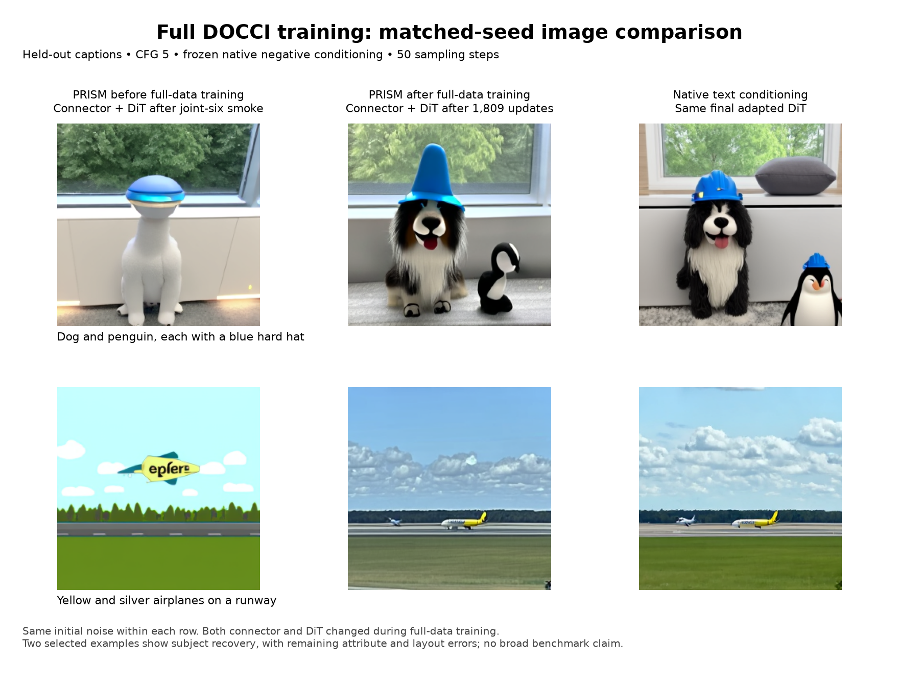

# DOCCI conditioning and staged-training evidence

## Final image demo

After joint training on all 9,647 prepared DOCCI pairs, the same held-out prompts
and initial noise recover a distinct dog/penguin pair and two aircraft. Hats,
colors and placement remain imperfect; these two examples are a qualitative
demo, not a broad image-generation benchmark. All columns use CFG5 and 50
sampling steps. Native conditioning in the last column uses the final adapted DiT.

[Full evaluation and limitations](../../../reports/2026-09-22-docci-alignment-stages.md#completed-caption-conditioning-evaluation)

See [the execution report](../../../reports/2026-09-22-docci-alignment-stages.md)
for completed results, submitted jobs and the full-data candidate.

- `runs/batch4-smoke-01/`: completed six-update real checkpoint smoke; 24 training
  exposures; both optimizer groups changed and frozen weights stayed unchanged.
- `runs/conditioning-01/`: completed eight-caption diagnostic, 24 paired
  timestep/noise probes and 14 generated images. Raw/chat comparisons were
  rendered and inspected; no PRISM route restores the requested principal
  objects in the two generation cases.
- `runs/overfit32-256-01/interim-step90/`: explicitly incomplete report snapshot,
  containing fixed train/validation losses at steps 0 and 64. Final generation
  and frozen-state acceptance are pending; this is not a completed run.
- `runs/overfit32-256-01/interim-step192/`: second running snapshot with fixed
  evaluations through step 192, step-128 training/validation galleries and
  inspected qualitative findings. No principal subjects are recovered in those
  four PRISM images; native CFG1 controls retain the held-out subjects.
- `runs/overfit32-256-01/`: completed 256-update run, 1,024 exposures and 32 uses
  of every selected pair. Both trainable groups changed and frozen state stayed
  unchanged; checkpoint digest was independently verified. The final galleries
  show partial learning of the pine-tree training subject but still miss the
  clock and held-out subjects. Final plots retain the same validation cohort.
- `runs/conditioning-overfit256-01/`: completed joint-checkpoint diagnostic, job
  `8848158`; all actual paired noisy-input/timestep hashes match. Correct-caption
  wins are 23/24 training and 13/24 held-out probes for PRISM, versus 24/24 and
  23/24 for native conditioning with the same adapted DiT. PRISM images still
  miss the two held-out subjects.
- `runs/feature-alignment32-1000-01/`: completed connector-only teacher-feature
  alignment, job `8848159`. All 40 input audits passed; every training caption
  received 125 exposures, totaling 4,000. Frozen weights stayed unchanged and
  the terminal checkpoint digest was independently verified. `plots/` contains
  content/template MSE and cosine curves, PDF and numeric series. Feature
  improvement does not establish generation quality.
- `runs/conditioning-aligned1000-01/`: completed job `8848222`, using the strict
  alignment restore helper and original frozen DiT. Actual paired input hashes,
  source identity and frozen hashes passed. PRISM wins 18/24 training and 16/24
  held-out caption probes, but its denoising losses remain above native and
  generated images still miss both held-out subjects. Native CFG5 and PRISM
  CFG1 images are not matched-guidance comparisons.
- `runs/conditioning-template-swap-01/`: completed job `8848325`; native/aligned
  PRISM and prefix/suffix/both-template hybrids under matched CFG1. All source,
  actual input/conditioning and frozen-state audits passed. Prefix replacement
  removes about 98% of excess matched flow MSE on this four-target cohort and
  restores coherent scenes, but subject fidelity remains inadequate. Suffix-only
  replacement has little effect. Teacher-assisted hybrids are diagnostic controls,
  not deployable PRISM improvements.
- `runs/feature-alignment-regions32-1000-01/`: completed job `8848399`, 1,000
  connector updates and exactly 4,000 caption exposures on the same 32/eight
  cohort. All execution/artifact checks, frozen hashes and initializer/terminal
  digests passed. Held-out equal-region loss fell 96.33%, prefix cosine reached
  0.9989, and caption-content loss was retained. The nine-panel `plots/` captures
  feature learning; image quality still requires the generation diagnostic.
- `runs/conditioning-regions1000-01/`: completed job `8848573`, 446.82 seconds.
  Strict schema-2 restore, all 48 paired flow controls, ten image hashes and
  2,220 frozen hashes passed. Held-out PRISM flow MSE is 0.493149 versus native
  0.485447. CFG5 partially recovers aircraft but still misses the penguin and
  other caption details; CFG1 misses principal objects. The saved comparison
  contains matched native CFG1/CFG5 references. Full-data quality is unproven.
- `runs/aligned-regions-joint-smoke-01/`: completed job `8848651`, six joint
  updates and 96 exposures (three per selected pair). Both groups changed,
  frozen weights stayed unchanged and terminal digest passed. Steady accumulated
  updates averaged 11.14 seconds; peak device memory was 27.74 GiB. Fixed losses
  rose slightly and held-out subject failures persist; initial/final galleries
  and loss plots are saved. Successful mechanics do not establish quality.
- `runs/conditioning-aligned-joint6-01/`: completed job `8848734`, 485.92 seconds.
  All 48 actual paired flow inputs replay earlier diagnostic cases, all fourteen
  image hashes pass, and original-native controls replay byte-for-byte. Held-out
  PRISM loss is flat but its caption gap falls 11.39%; matched-seed images worsen
  while adapted-native references remain visually stable. The saved before/after
  gallery and independent summary document combined-update effects; they do not
  isolate connector changes from DiT changes.
- `runs/joint-components-01/`: completed frozen component diagnostic `8848800`,
  1,010.69 seconds. Both checkpoint digests, fifteen source identities, all paired
  flow/CFG/image/latent controls and frozen-state/restoration audits passed.
  Updated connector + original DiT reproduces the degraded images; aligned
  connector + adapted DiT remains visually similar to baseline. Held-out prefix
  feature MSE rises 20.18× under the same original normalization. This identifies
  the dominant effect in two cases, without establishing broader image quality.
- `runs/aligned-regions-joint-lr1e5-smoke-01/`: completed job `8848832`, 559.67 seconds; repeats
  six joint updates from the same region initializer with connector LR 1e-5 and
  unchanged DiT LR 2e-6. Planned 96 exposures, three per selected pair; immutable
  source reused and all other training/evaluation settings preserved. Checkpoint
  and artifact acceptance passed. Its proposed follow-up factorial is superseded
  by the user's explicit request to proceed with full-data joint training.
- `jobs/full-docci-joint-3epochs-01/`: completed job `8848858`, all 9,647 prepared
  training pairs, 1,809 updates at effective batch 16 (three passes plus three
  exposures), connector/DiT LRs 1e-4/2e-6. Fresh stage from audited joint-six
  checkpoint, chat/CFG5/native negative, separate 100-pair validation. Twelve-hour
  allocation, one node/process/XPU tile. Actual submitted command and reviews are
  saved in provenance. Final evidence in `runs/full-docci-joint-3epochs-01/`
  verifies 28,944 exposures, both groups changed, 1,634 unchanged frozen tensors
  and the terminal checkpoint digest. Fixed-cohort train/validation MSE fell
  0.73%/1.24%; loss curves and initial/final galleries are saved. Interim step-200
  and step-400 collections remain separate and unchanged.
- `runs/full-docci-joint-conditioning-01/`: completed evaluation job `8854234`,
  521.15 seconds, 48 paired flow cases and fourteen images. All 2,220 frozen tensor
  hashes and artifact checks passed. Held-out PRISM matched flow MSE is 0.482828
  versus adapted native 0.481150; correct-caption wins are 22/24 versus 24/24.
  Saved guidance and matched-seed before/after galleries show subject recovery
  with remaining attribute errors. These are eight held-out targets at three
  times and two image cases, not a broad generation benchmark.
- `provenance/components/`: reviewed standalone collector/renderer and artifact
  fixtures for the distinct component diagnostic. Use `--verify-checkpoints`
  (plural) with its new source snapshot. Protocol integration passed 218 tests;
  metadata tests include an archive round trip and 32 negative controls.
- `provenance/*-acceptance-checks.json`: source, execution and artifact checks.
  These are not generation-quality acceptance or benchmark scores.
- `provenance/source-snapshots/<run>/`: exact executed source bytes collected
  separately for each run. The archive's `prism/` members were relocated here to
  prevent snapshots from different executed versions overwriting one another.
- `provenance/pack_run.py` and `render_conditioning.py`: bounded collectors and
  reproducible gallery renderer. No checkpoint or optimizer bytes are included.
- `provenance/pack_feature_alignment.py` and `plot_feature_alignment.py`: distinct
  feature-checkpoint evidence collector and reproducible learning curves.
- `provenance/regions/`: versioned collector and nine-panel renderer supporting
  strict region-alignment evidence, with sibling `pack_run.py`. Collection must
  use `--verify-checkpoint` and the correct source snapshot. Initializer and
  terminal digests, exact collector bytes and initializer report are retained.
- `provenance/feature-alignment-regions-command.json`: submitted command for
  job `8848399`; the similarly named `NOT-SUBMITTED` file is its retained
  pre-submission proposal. `conditioning-regions1000-command.json` is the
  submitted diagnostic command, with corrected actual schema-2 checkpoint
  filename and verified digest. Its `NOT-SUBMITTED` predecessor remains historical.
- `provenance/render_template_swap.py`: strict completed-evidence audit and
  six-column target/CFG1 gallery for the template-swap diagnostic.
- `provenance/full-data-candidate-NOT-SUBMITTED.json`: proposed three-pass
  full-data training command. Its existence is not execution evidence.

DOCCI target images are Google DOCCI, CC BY 4.0, extracted from the prepared
WebDataset by verified member offsets and SHA256. Targets are comparison material
and never enter caption-only generation. Model checkpoints remain on Aurora at
`/lus/flare/projects/ModCon/sandeep/prism-docci-alignment-20260922`.

The authorized full-data training and evaluation are complete. Scheduled follow-up
`continue-prism-docci-alignment-and-training` has been stopped. Further training or dataset downloads require a new instruction. The user
separately authorized publication of these updates and the final visual demo
to the existing decoder branch and PR #175.
