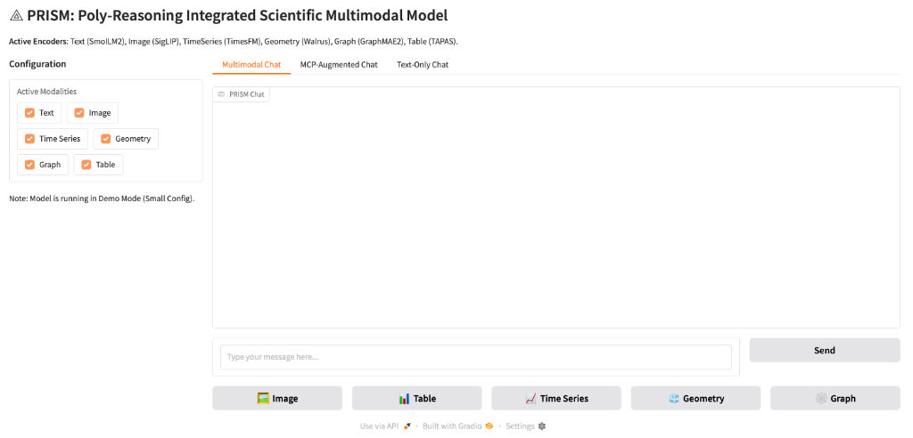

# Getting Started

This page takes you from a clone to a first run. It covers the four platforms
PRISM is used on today and links to the detailed guide for each.

If you only want to read about the system rather than run it, start at the
[documentation index](index.md).

## 1. Clone the repository

PRISM vendors the Walrus geometry encoder as a git submodule, so clone
recursively:

```bash
git clone --recursive https://github.com/AI-ModCon/BaseMM_PRISM.git
cd BaseMM_PRISM
```

If you already cloned without `--recursive`:

```bash
git submodule update --init --recursive
```

## 2. Build an environment

PRISM requires **Python 3.10 or newer**. CI exercises 3.10 and 3.12; Aurora's
`frameworks/2025.3.1` module is Python 3.12, which is what the checked-in
lockfiles target.

**Which path you take depends on your machine.** The single most important rule
is that on an HPC system with a site-provided PyTorch module, you must never let
`pip` or `uv` resolve `torch` from PyPI — doing so installs a generic wheel that
shadows the accelerator-aware build and produces linker errors at import time.
The platform scripts below all install with `--no-deps` for this reason.

| Platform | Accelerator | Command | Support | Guide |
|---|---|---|---|---|
| **Aurora** | Intel Max GPU (XPU) | `bash tools/build_aurora_env.sh` | Tested | [platforms/aurora_operations.md](platforms/aurora_operations.md) |
| **Polaris** | NVIDIA A100 (CUDA) | `bash tools/setup_polaris_env.sh` | Tested | [platforms/running_on_polaris.md](platforms/running_on_polaris.md) |
| **Perlmutter** | NVIDIA A100 (CUDA) | *No setup script yet — see below* | Best-effort | [platforms/running_on_perlmutter.md](platforms/running_on_perlmutter.md) |
| **Laptop / workstation / CI** | CPU or a single CUDA GPU | `pip install -r requirements/base.txt` | CPU: tested on `ci.txt`, best-effort on `base.txt`; CUDA: best-effort | This page |

**Tested** means a CI leg or a dated run recorded in this repository exercises
that path. Aurora and Polaris each have job IDs and throughput written down —
[results/scaling_study.md](results/scaling_study.md) and the comparison table in
[platforms/running_on_polaris.md](platforms/running_on_polaris.md) — and the
CPU path runs on every pull request — but CI installs the narrower
`requirements/ci.txt`, so the `base.txt` line in the table above is the one
install command no CI leg exercises; it is best-effort on that basis, and the
row says so. **Best-effort** means
the code and the guide are real but nothing re-checks them on each change:
Perlmutter has no environment script (see below), and no CI leg or recorded run
covers a single-GPU CUDA workstation, so the `gpu`-marked tests are deselected
in every job.

The README's [Installation section][readme-install] is the authoritative
reference for the HPC paths, including the Aurora shared-venv versus packed-
tarball choice and the required module-load ordering. This page does not repeat
it.

[readme-install]: ../README.md#installation

### Aurora

```bash
# One-time: install uv on the login node
curl -LsSf https://astral.sh/uv/install.sh | sh

VENV_PATH=/flare/ModCon/$USER/prism-envs/py3.12 \
    bash tools/build_aurora_env.sh
```

The script loads `frameworks/2025.3.1`, installs the lockfile delta over the
module's site-packages with `--no-deps`, verifies that `torch` still resolves to
the framework build rather than the venv, and writes a `PRISM_BUILD_INFO`
provenance manifest.

To serve a checkpoint through vLLM you also need PRISM registered as an entry
point, which is what the packaging metadata in `pyproject.toml` is for:

```bash
bash tools/install_prism_entry_point.sh   # runs `pip install -e . --no-deps`
```

### Polaris

```bash
bash tools/setup_polaris_env.sh   # builds .venv-polaris atop conda/2025-09-28
```

Polaris deliberately uses the standard-library `venv` and `pip` rather than
`uv`; the reasoning is recorded in the script itself.

### Perlmutter

> **Known gap.** There is no `tools/setup_perlmutter_env.sh`. The intended
> dependency set lives in `requirements/perlmutter.txt`, but that file lists
> `torch_scatter`, `torch_sparse`, and `torch_cluster` uncommented, annotated
> only with "Might need `--find-links` in setup script" — the script that
> comment refers to was never written. A plain `pip install -r` against it will
> therefore try to build those three from source against whatever `torch` is
> resolved. Follow
> [platforms/running_on_perlmutter.md](platforms/running_on_perlmutter.md) and
> expect to sort the PyG extensions out by hand.

### Laptop, workstation, or CI

No accelerator-specific module is involved here, so an ordinary virtual
environment works:

```bash
python -m venv .venv && source .venv/bin/activate
pip install -r requirements/base.txt
pip install -e . --no-deps
```

`--no-deps` on the second command is deliberate: it installs PRISM's packaging
metadata and the `prism` console script without re-resolving the dependency set
you just pinned.

The PyG C++ extension wheels (`pyg_lib`, `torch_scatter`, `torch_sparse`,
`torch_cluster`) are commented out in `requirements/base.txt`. You do not need
them for the graph modality — `GraphEncoder` only uses
`torch_geometric.nn.GATConv`, which works without the compiled extensions.
Uncomment them only if you need the extension-backed operators *and* your
platform has matching prebuilt wheels.

## 3. Verify the install

```bash
prism --help
```

Then run the subset of the test suite that needs no hardware, network, or large
fixtures — this is exactly what CI runs:

```bash
pytest -q \
  -m "not multimodal and not launcher and not integration and not network and not slow and not gpu and not aurora and not perlmutter" \
  tests
```

See [training/cli.md](training/cli.md) for the full CLI surface.

## 4. Run something

### Training

All training goes through the Hydra-configured entry point rather than
standalone scripts. Start with [training/training.md](training/training.md) for
entry points and stage selection, and
[training/cli.md](training/cli.md) for the command surface.

On Aurora, jobs are submitted through the launchers documented in
[platforms/aurora_operations.md](platforms/aurora_operations.md).

### Inference

For batched inference on a trained checkpoint, PRISM ships an in-tree vLLM
plugin:

```bash
python tools/vllm_serve.py --model <prism-checkpoint>
```

See [evaluation/inference_vllm.md](evaluation/inference_vllm.md) for the plugin
architecture and serving options, and `tools/vllm_eval.py` for the evaluation
harness.

### OpenAI-compatible API server

```bash
python src/api/server.py
```

Endpoint: `http://localhost:8000/v1`.

### Web UI (Gradio)

```bash
python src/ui/app.py
```

Access at `http://localhost:7860`.



- **Multimodal chat**: upload images, tables, time series, geometry, or graphs
  using the dedicated buttons.
- **Text-only chat**: switch to the "Text-Only" tab to exercise the base LLM in
  isolation.
- **Active encoders**: the sidebar lists which encoders are currently loaded.

## Where to go next

| If you want to… | Read |
|---|---|
| Understand the architecture | [index.md](index.md), [api/model.md](api/model.md) |
| Submit a job on Aurora | [platforms/aurora_operations.md](platforms/aurora_operations.md) |
| Prepare or convert data | [training/data.md](training/data.md) |
| Add a new modality | [skills/prism-adding-a-modality/SKILL.md](skills/prism-adding-a-modality/SKILL.md) |
| See measured throughput | [results/scaling_study.md](results/scaling_study.md) |
| Contribute a change | [../CONTRIBUTING.md](../CONTRIBUTING.md) |
