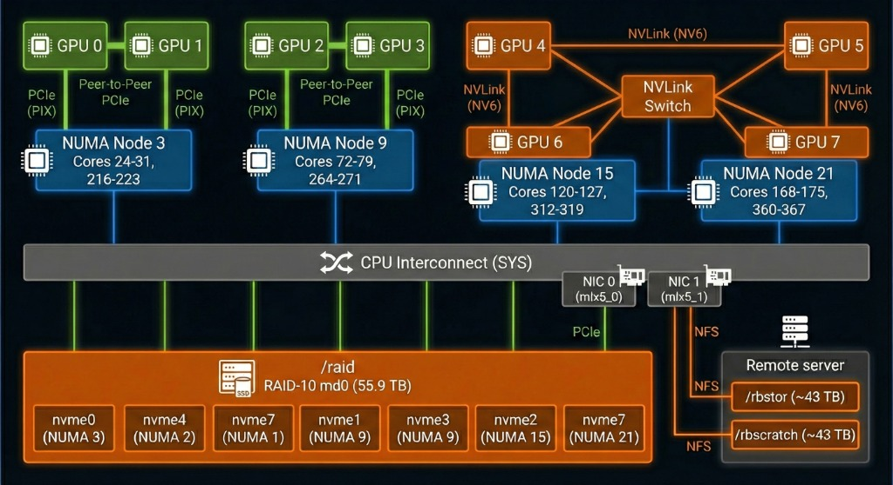

# Running PRISM on RBDGX3

This guide details the specific hardware topology of the `rbdgx3` machine and the optimized launch scripts available for training PRISM on it.

## Hardware Topology

RBDGX3 is an 8-GPU node with a heterogeneous interconnect topology, featuring both NVLink and PCIe connections.



### Key Features
*   **NVLink Island (GPUs 4-7)**: A high-bandwidth cluster connected via NVLink Switch (NV6). Ideally suited for model parallelism or fast data parallelism.
*   **PCIe Island (GPUs 0-3)**: Connected via PCIe/Sys constraints.
*   **NUMA Nodes**: 4 distinct NUMA nodes. Correct CPU affinity is critical for performance to avoid traversing the QPI/UPI interconnect unnecessarily.

## Experimentation Tools

We provide a unified tool `tools/launch_baremetal.py` that handles the complexity of the RBDGX3 topology automatically.

### Usage
```bash
python tools/launch_baremetal.py --id <EXPERIMENT_ID> [--dry-run]
```
This tool reads from `experiments/prism_designs.yaml` and generates a specifically tuned shell script (e.g., `run_exp_PRISM-ZONE-A-BASELINE.sh`) incorporating the correct environment variables, `numactl` pinning, and `accelerate` flags.

## Supported Topologies

Different hardware configurations are defined as "topologies" in the experiment YAML.

### 1. `4gpu_nvlink` (Recommended for Dev)
*   **Target**: GPUs 4, 5, 6, 7 (NVLink Island)
*   **Mechanism**: Exports `CUDA_VISIBLE_DEVICES=4,5,6,7`.
*   **Use Case**: Fast iteration, prototyping.

### 2. `8gpu_pinned` (Recommended for Training)
*   **Target**: All 8 GPUs (0-7).
*   **Mechanism**: Wraps the training script in `numactl` to pin each rank to its optimal CPU cores and NUMA node (e.g., Rank 0 -> NUMA 3). This is crucial to avoid QPI bottlenecks.
*   **Use Case**: Full scale training.

### 3. `1gpu_debug`
*   **Target**: GPU 4 (NVLink safe).
*   **Mechanism**: Exports `CUDA_VISIBLE_DEVICES=4` and runs single process.
*   **Use Case**: Debugging.

## Configuration
The entry point is now `train.py` (Hydra-enabled). Old scripts (`run_zone_a.py`) are deprecated for direct use.
